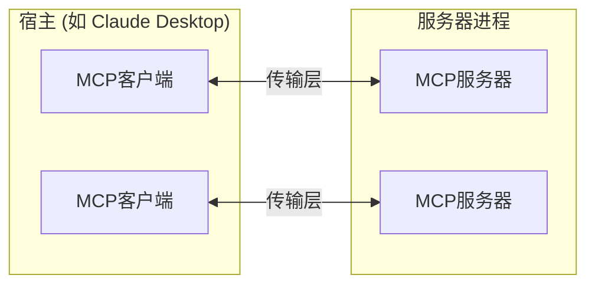
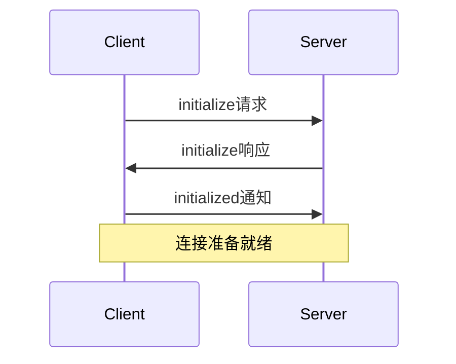

模型上下文协议（Model Context Protocol，MCP）建立在灵活、可扩展的架构之上，实现了LLM应用程序和集成之间的无缝通信。本文档涵盖了核心架构组件和概念。

## 概述

MCP遵循客户端-服务器架构，其中：

- **宿主**是启动连接的LLM应用程序（如Claude Desktop或IDE）
- **客户端**在宿主应用程序内与服务器保持1:1连接
- **服务器**向客户端提供上下文、工具和提示



## 核心组件

### 协议层

协议层处理消息帧、请求/响应链接和高级通信模式。

<Tabs>
  <Tab title="TypeScript">
    ```typescript
    class Protocol<Request, Notification, Result> {
        // 处理传入请求
        setRequestHandler<T>(schema: T, handler: (request: T, extra: RequestHandlerExtra) => Promise<Result>): void

        // 处理传入通知
        setNotificationHandler<T>(schema: T, handler: (notification: T) => Promise<void>): void

        // 发送请求并等待响应
        request<T>(request: Request, schema: T, options?: RequestOptions): Promise<T>

        // 发送单向通知
        notification(notification: Notification): Promise<void>
    }
    ```
  </Tab>
  <Tab title="Python">
    ```python
    class Session(BaseSession[RequestT, NotificationT, ResultT]):
        async def send_request(
            self,
            request: RequestT,
            result_type: type[Result]
        ) -> Result:
            """
            发送请求并等待响应。如果响应包含错误则抛出McpError。
            """
            # 请求处理实现

        async def send_notification(
            self,
            notification: NotificationT
        ) -> None:
            """发送不需要响应的单向通知。"""
            # 通知处理实现

        async def _received_request(
            self,
            responder: RequestResponder[ReceiveRequestT, ResultT]
        ) -> None:
            """处理来自对方的传入请求。"""
            # 请求处理实现

        async def _received_notification(
            self,
            notification: ReceiveNotificationT
        ) -> None:
            """处理来自对方的传入通知。"""
            # 通知处理实现
    ```
  </Tab>
</Tabs>

主要类包括：

* `Protocol`
* `Client`
* `Server`

### 传输层

传输层处理客户端和服务器之间的实际通信。MCP支持多种传输机制：

1. **标准输入输出传输**
   - 使用标准输入/输出进行通信
   - 适用于本地进程

2. **带SSE的HTTP传输**
   - 使用服务器发送事件（Server-Sent Events）进行服务器到客户端的消息传输
   - 使用HTTP POST进行客户端到服务器的消息传输

所有传输都使用[JSON-RPC](https://www.jsonrpc.org/) 2.0来交换消息。有关模型上下文协议消息格式的详细信息，请参阅[规范](https://spec.modelcontextprotocol.io)。

### 消息类型

MCP有以下主要消息类型：

1. **请求**需要对方响应：
    ```typescript
    interface Request {
      method: string;
      params?: { ... };
    }
    ```

2. **结果**是对请求的成功响应：
    ```typescript
    interface Result {
      [key: string]: unknown;
    }
    ```

3. **错误**表示请求失败：
    ```typescript
    interface Error {
      code: number;
      message: string;
      data?: unknown;
    }
    ```

4. **通知**是不需要响应的单向消息：
    ```typescript
    interface Notification {
      method: string;
      params?: { ... };
    }
    ```

## 连接生命周期

### 1. 初始化



1. 客户端发送带有协议版本和功能的`initialize`请求
2. 服务器响应其协议版本和功能
3. 客户端发送`initialized`通知作为确认
4. 开始正常的消息交换

### 2. 消息交换

初始化后，支持以下模式：

- **请求-响应**：客户端或服务器发送请求，对方响应
- **通知**：任何一方发送单向消息

### 3. 终止

任何一方都可以终止连接：
- 通过`close()`进行清理关闭
- 传输断开
- 错误条件

## 错误处理

MCP定义了以下标准错误代码：

```typescript
enum ErrorCode {
  // 标准JSON-RPC错误代码
  ParseError = -32700,
  InvalidRequest = -32600,
  MethodNotFound = -32601,
  InvalidParams = -32602,
  InternalError = -32603
}
```

SDK和应用程序可以在-32000以上定义自己的错误代码。

错误通过以下方式传播：

- 错误响应
- 传输错误事件
- 协议级错误处理程序

## 实现示例

以下是一个基本的MCP服务器实现示例：

<Tabs>
  <Tab title="TypeScript">
    ```typescript
    import { Server } from "@modelcontextprotocol/sdk/server/index.js";
    import { StdioServerTransport } from "@modelcontextprotocol/sdk/server/stdio.js";

    const server = new Server({
      name: "example-server",
      version: "1.0.0"
    }, {
      capabilities: {
        resources: {}
      }
    });

    // 处理请求
    server.setRequestHandler(ListResourcesRequestSchema, async () => {
      return {
        resources: [
          {
            uri: "example://resource",
            name: "示例资源"
          }
        ]
      };
    });

    // 连接传输
    const transport = new StdioServerTransport();
    await server.connect(transport);
    ```
  </Tab>
  <Tab title="Python">
    ```python
    import asyncio
    import mcp.types as types
    from mcp.server import Server
    from mcp.server.stdio import stdio_server

    app = Server("example-server")

    @app.list_resources()
    async def list_resources() -> list[types.Resource]:
        return [
            types.Resource(
                uri="example://resource",
                name="示例资源"
            )
        ]

    async def main():
        async with stdio_server() as streams:
            await app.run(
                streams[0],
                streams[1],
                app.create_initialization_options()
            )

    if __name__ == "__main__":
        asyncio.run(main)
    ```
  </Tab>
</Tabs>

## 最佳实践

### 传输选择

1. **本地通信**
   - 使用标准输入输出传输进行本地进程通信
   - 本地通信高效
   - 简单的进程管理

2. **远程通信**
   - 使用带SSE的HTTP传输进行需要HTTP兼容性的场景
   - 考虑安全性，包括身份验证和授权

### 消息处理

1. **请求处理**
   - 仔细验证输入
   - 使用类型安全的模式
   - 妥善处理错误
   - 实现超时

2. **进度报告**
   - 使用进度令牌进行长时间操作
   - 分步报告进度
   - 包括总进度（如果已知）

3. **错误管理**
   - 使用适当的错误代码
   - 包括有用的错误消息
   - 清理资源
   - 处理拒绝服务（DoS）场景

## 安全考虑

1. **传输安全**
   - 使用TLS进行远程连接
   - 验证连接来源
   - 实现身份验证（如果需要）

2. **消息验证**
   - 验证所有传入消息
   - 清理输入
   - 检查消息大小限制
   - 验证JSON-RPC格式

3. **资源保护**
   - 实现访问控制
   - 验证资源路径
   - 监视资源使用情况
   - 限制请求速率

4. **错误处理**
   - 不要泄露敏感信息
   - 记录安全相关错误
   - 妥善清理
   - 处理拒绝服务（DoS）场景

## 调试和监控

1. **日志记录**
   - 记录协议事件
   - 跟踪消息流
   - 监视性能
   - 记录错误

2. **诊断**
   - 实现健康检查
   - 监视连接状态
   - 跟踪资源使用情况
   - 分析性能

3. **测试**
   - 测试不同的传输
   - 验证错误处理
   - 检查边缘情况
   - 负载测试服务器
