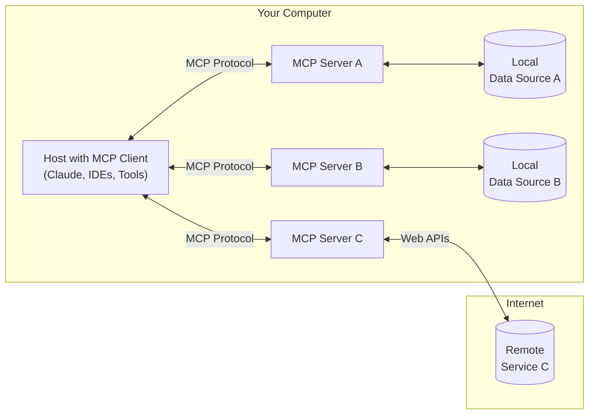

<Note>Java SDK 发布！查看 [更多更新。](/development/updates)</Note>

MCP 是一个开放协议，它标准化了应用程序如何向 LLM 提供上下文。想象一下，MCP 类似于 AI 设备的 USB-C 接口，它提供了连接不同外设和配件的标准方法，就像 USB-C 提供了连接不同外设和配件的标准方法一样。

## Why MCP?

MCP 帮助你构建基于 LLM 的代理和复杂工作流。LLMs 频繁地需要集成数据和工具，MCP 提供了:
- 一个正在增长的集成列表，让你的 LLM 直接插入
- LLM 提供者和供应商之间的灵活性
- 与您的数据安全性的最佳实践

### 通用架构

MCP 的核心是一个客户端-服务器架构，它允许一个主机应用程序连接到多个服务器:

- **MCP 主机**: 像 Claude Desktop、IDE 或 AI 工具这样的程序，它们希望通过 MCP 访问数据
- **MCP 客户端**: 维护与服务器 1:1 连接的协议客户端
- **MCP 服务器**: 每个暴露特定功能的轻量级程序通过标准化的模型上下文协议
- **本地数据源**: 您计算机的文件、数据库和服务，MCP 服务器可以安全地访问
- **远程服务**: 可以通过互联网（例如，通过 API）访问的外部系统，MCP 服务器可以连接到

## 开始使用

选择最适合您的路径：

#### 快速入门
<CardGroup cols={2}>
  <Card
    title="面向服务器开发者"
    icon="bolt"
    href="/quickstart/server"
  >
    开始构建您自己的服务器，以便在 Claude Desktop 和其他客户端中使用
  </Card>
  <Card
    title="面向客户端开发者"
    icon="bolt"
    href="/quickstart/client"
  >
    开始构建您自己的客户端，该客户端可以与所有 MCP 服务器集成
  </Card>
  <Card
    title="面向 Claude Desktop 用户"
    icon="bolt"
    href="/quickstart/user"
  >
    开始在 Claude Desktop 中使用预构建的服务器
  </Card>
</CardGroup>

#### 示例
<CardGroup cols={2}>
  <Card
    title="示例服务器"
    icon="grid"
    href="/examples"
  >
    查看我们的官方 MCP 服务器和实现的图库
  </Card>
  <Card
    title="示例客户端"
    icon="cubes"
    href="/clients"
  >
    查看支持 MCP 集成的客户端列表
  </Card>
</CardGroup>

## 教程

<CardGroup cols={2}>
  <Card
    title="使用 LLM 构建 MCP"
    icon="comments"
    href="/tutorials/building-mcp-with-llms"
  >
    了解如何使用像 Claude 这样的 LLM 来加速您的 MCP 开发
  </Card>
  <Card
  title="调试指南"
  icon="bug"
  href="/docs/tools/debugging">
    了解如何有效地调试 MCP 服务器和集成
  </Card>
  <Card
    title="MCP 检查器"
    icon="magnifying-glass"
    href="/docs/tools/inspector"
  >
    使用我们的交互式调试工具测试和检查您的 MCP 服务器
  </Card>
</CardGroup>

## 探索 MCP

深入了解 MCP 的核心概念和功能：

<CardGroup cols={2}>
  <Card
    title="核心架构"
    icon="sitemap"
    href="/docs/concepts/architecture"
  >
    了解 MCP 如何连接客户端、服务器和 LLM
  </Card>
  <Card
    title="资源"
    icon="database"
    href="/docs/concepts/resources"
  >
    将数据和内容从您的服务器暴露给 LLM
  </Card>
  <Card
    title="提示词"
    icon="message"
    href="/docs/concepts/prompts"
  >
    创建可重用的提示词模板和工作流
  </Card>
  <Card
    title="工具"
    icon="wrench"
    href="/docs/concepts/tools"
  >
    使 LLM 能够通过您的服务器执行操作
  </Card>
  <Card
    title="采样"
    icon="robot"
    href="/docs/concepts/sampling"
  >
    让您的服务器从 LLM 请求补全
  </Card>
  <Card
    title="传输"
    icon="network-wired"
    href="/docs/concepts/transports"
  >
    了解 MCP 的通信机制
  </Card>
</CardGroup>

## 贡献

想要贡献吗？查看我们的[贡献指南](/development/contributing)以了解如何帮助改进 MCP。

## 支持和反馈

以下是如何获得帮助或提供反馈：

- 对于与 MCP 规范、SDK 或文档（开源）相关的错误报告和功能请求，请[创建一个 GitHub issue](https://github.com/modelcontextprotocol)
- 对于关于 MCP 规范的讨论或问答，请使用[规范讨论](https://github.com/modelcontextprotocol/specification/discussions)
- 对于关于其他 MCP 开源组件的讨论或问答，请使用[组织讨论](https://github.com/orgs/modelcontextprotocol/discussions)
- 对于与 Claude.app 和 claude.ai 的 MCP 集成相关的错误报告、功能请求和问题，请发送电子邮件至 mcp-support@anthropic.com